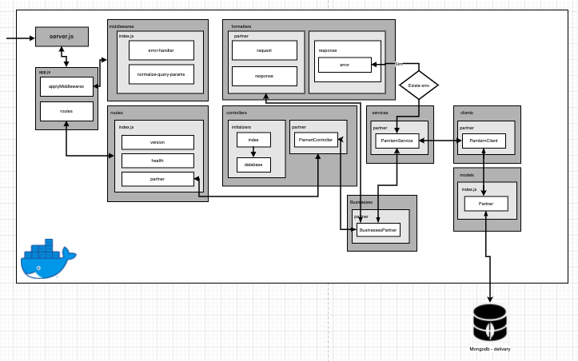

# Test Interview Ze Delivery

## Tecnologies
 - Nodejs
 - Express
 - Chai
 - Mocha
 - Sinon
 - Docker
 - Mongodb
 - Joi
 - Celebrate

## Setup
Must be installed docker and docker-compose

  - On Windows
> https://docs.docker.com/docker-for-windows/install/
  - On Ubuntu
> https://docs.docker.com/engine/install/ubuntu/
  - On Macosx
> https://docs.docker.com/docker-for-mac/install/

 **If you use windows maybe you must to install _Make_**
> http://gnuwin32.sourceforge.net/packages/make.htm


## First Steps
### Run to build a container (<span style="color:red"> it may take a while to install if you don't have the image built </span>)
```bash
make build
```
- make build it's command to run a docker-compose.yml and it makes a images build as **_app_**, **_delivery-database_**

### Start the system
```bash
make start
```
### Enter container 
```bash
make run
```
### Stop system
```bash
make stop
```
### Remove the system
```bash
make remove
```

## See application logs

#### All logs
```bash
make logs
```

#### Last 100 line (HEAD)
```bash
make logs-tail
```

## Test

### To run lint + unit tests
```bash
make test
```

### lint
```bash
make lint
```

### Unit tests
```bash
make mocha
```
## Release

### Release
```bash
make release
```
## Pre-release
```bash
make prerelease
```

## Deploy
To deploy the application you can run a Docker inside folder
**docker/deploy** and call a command to start
Example:
 Steps:
  - Clone the application
  - run docker build
```bash
docker build [OPTIONS] PATH | URL | -
```
 - And run the command inside container to run a application
```
npm run start
```

## Routes
 - version
> http://localhost:4001/version
 - health
> http://localhost:4001/health
 - Search by id
> http://localhost:4001/partner?pid=[ID]
 - Search by lat and long
> http://localhost:4001/partner?lat=[LAT]&long=[LONG]
 - Search by id, lat and long
> http://localhost:4001/partner?pid=[ID]&lat=[LAT]&long=[LONG]
 - Get all nearest partners
> http://localhost:4001/partner?lat=[LAT]&long=[LONG]>&allNearest=true

**This route is used when you want to get all nearest partner**

#### Description route params
| Params   |      type      | example | description  | 
|----------|:-------------:|:--------:|------:|
| pid  | Number  | /partner?pid=12 | Partner id  |
| lat  | Number  | /partner?lat=-12 | Latitute |
| long | Number  | /partner?long=12 | Longitude|
| allNearest | Boolean | /partner?allNearest=true | get all nearest partner when you using lat and long|

**Obs: when yout put lat you must to set in query string a long**
    

## flow diagram


